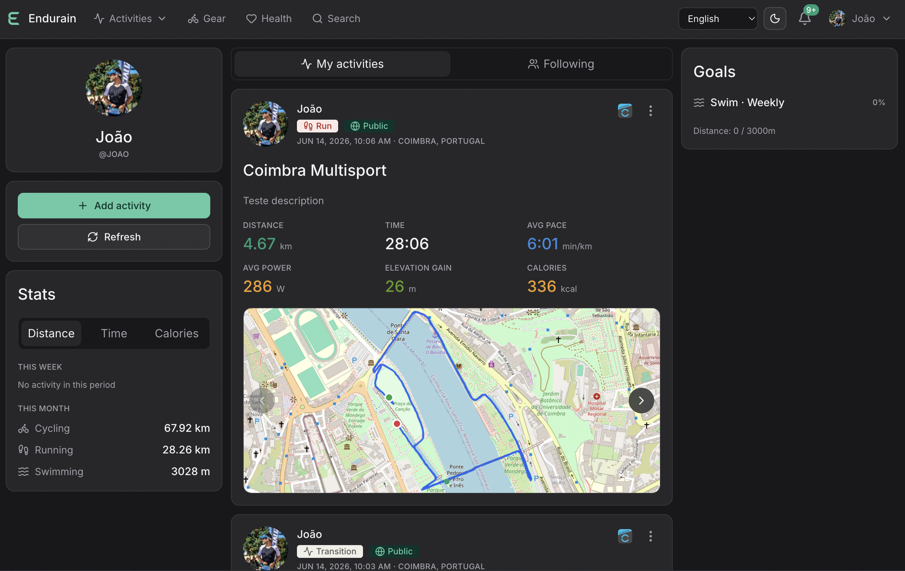

> [!NOTE]
> **GitHub Mirror** - If you are viewing this on GitHub, please be aware that this repository is a read-only mirror. Issues, pull requests, and all project activity are tracked on Codeberg: [https://codeberg.org/endurain-project/endurain](https://codeberg.org/endurain-project/endurain)

> [!IMPORTANT]
> **This is the ZAPFIT fork** — a rebranded, locally-extended build of
> [Endurain](https://codeberg.org/endurain-project/endurain). ZAPFIT
> inherits Endurain's code under the AGPL-3.0-or-later licence and adds
> a first-time setup wizard, native Russian localisation, a `system`
> theme option and additional branding hooks. All upstream trademarks,
> project metadata and Codeberg issue trackers remain owned by the
> original Endurain authors. See [Acknowledgements](#acknowledgements)
> below for full credits.

> [!NOTE]
> **Endurain is on a temporary feature freeze** - The project is not paused. The focus is shifting from new features to strengthening the foundations. More details [here](https://docs.endurain.com/blog/2026/05/23/pausing-new-features-so-endurain-can-keep-growing/)

  

  # Endurain (ZAPFIT fork)

  
  
  
  
  

  **A self-hosted fitness tracking service**  
  Visit Endurain's [Mastodon profile](https://fosstodon.org/@endurain) and [Discord server](https://discord.gg/6VUjUq2uZR).

  

## 🚀 Try the Demo

Experience Endurain without installation:

**Demo URL:** [https://demo.endurain.com](https://demo.endurain.com)

- **Username:** `admin`
- **Password:** `admin`
- **Reset Schedule:** Daily at midnight (Europe/Lisbon timezone)

> ⚠️ **Note:** The demo environment resets every day. Do not store important data.

## Table of Contents

- [Endurain documentation](https://docs.endurain.com)
- [What is Endurain?](#what-is-endurain)
- [Endurain screenshots](https://docs.endurain.com/gallery/)
- [Sponsors](#sponsors)
- [Contributing](#contributing)
- [Help Translate](#help-translate)
- [License](#license)

## Acknowledgements

ZAPFIT is an independent **fork** of the [Endurain](https://codeberg.org/endurain-project/endurain) project (AGPL-3.0-or-later), originally authored by João Vitória Silva and the Endurain community. ZAPFIT builds on that foundation, and the upstream authors are owed a huge thank-you for their work.

Differences from upstream:
- First-time setup wizard (post-login, full server configuration in one pass).
- Native Russian (`ru`) localisation on the frontend.
- `system` UI theme option and a configurable default theme/language/brand name.
- `ZAPFIT_HOST` environment variable (legacy `ENDURAIN_HOST` still honoured).

## What is Endurain?

Endurain is a self-hosted fitness tracking service designed to give users full control over their data and hosting environment. It's similar to Strava but focused on privacy and customization. Built with:

- **Frontend:** Vue.js 3 with TypeScript, Tailwind CSS and shadcn-vue components, with Pinia and TanStack Query for state management
- **Backend:** Python FastAPI, Alembic, SQLAlchemy, Apprise, stravalib and python-garminconnect for Strava and Garmin Connect integration, gpxpy, tcxreader and fitdecode for .gpx, .tcx and .fit file import respectively
- **Database:** PostgreSQL for efficient data management
- **Observability:** Jaeger for basic tracing and monitoring
- **Integrations:** Supports Strava and Garmin Connect. Manual upload of activities using .gpx, .tcx and .fit files are also supported

To deploy Endurain, a Docker image is available, and a comprehensive example can be found in the "docker-compose.yml.example" file provided. Configuration is facilitated through environment variables, ensuring flexibility and ease of customization.

For more information please see the Endurain's [documentation](https://docs.endurain.com).

## Sponsors

A huge thank you to the project sponsors! Your support helps keep this project going.

Support Endurain's development on:

- [Buy Me a Coffee](https://buymeacoffee.com/endurain)
- [liberapay](https://liberapay.com/endurain/)
- [Patreon](https://patreon.com/u84745218)
- [GitHub Sponsors using archived repo](https://github.com/endurain-project/endurain)

## Contributing

Contributions are welcomed! Please open an issue to discuss any changes or improvements before submitting a PR. Check out the [Contributing Guidelines](CONTRIBUTING.md) for more details.

## Help Translate

Endurain has multi-language support, and you can help translate it into more languages via [Codeberg Translate](https://translate.codeberg.org/projects/endurain/). 

## License

This project is licensed under the AGPL-3.0-or-later License - see the [LICENSE](LICENSE) file for details.

## Trademark Notice

Endurain® is a trademark of João Vitória Silva and remains owned by the original authors.  

This **ZAPFIT fork** intentionally uses a distinct name and does not claim any rights to the Endurain name or logo. You are welcome to self-host ZAPFIT; commercial use of the **Endurain** name or logos (such as offering paid hosting, products, or services) is **not permitted without prior written permission** from the Endurain authors.

See [`TRADEMARK.md`](./TRADEMARK.md) for full details.

  ZAPFIT — a fork of <a href="https://codeberg.org/endurain-project">Endurain</a> | Built with ❤️

